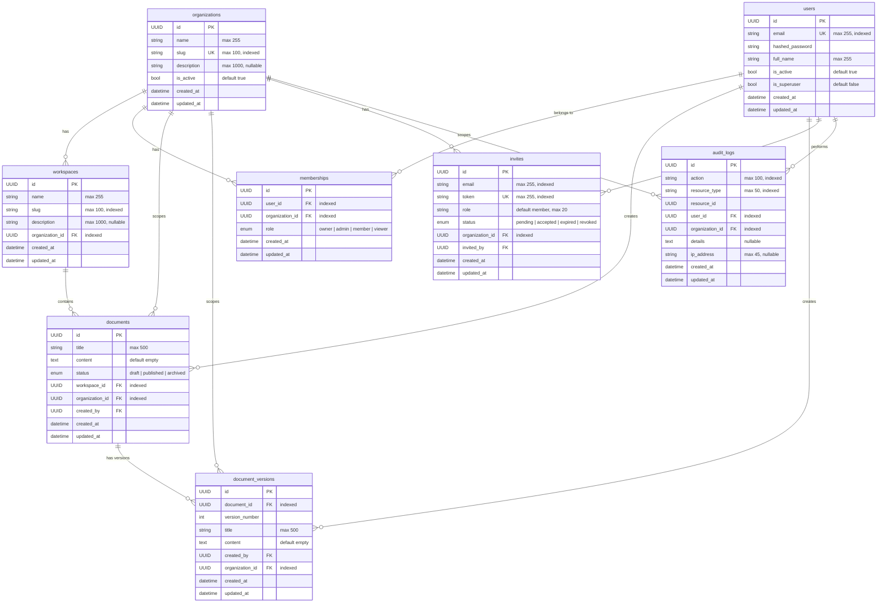

# KnowBase — Entity Relationship Diagram

> All entities inherit `id` (UUID PK), `created_at`, and `updated_at` from `BaseDBModel`.

```mermaid
erDiagram
    users {
        UUID id PK
        string email UK "max 255, indexed"
        string hashed_password
        string full_name "max 255"
        bool is_active "default true"
        bool is_superuser "default false"
        datetime created_at
        datetime updated_at
    }

    organizations {
        UUID id PK
        string name "max 255"
        string slug UK "max 100, indexed"
        string description "max 1000, nullable"
        bool is_active "default true"
        datetime created_at
        datetime updated_at
    }

    workspaces {
        UUID id PK
        string name "max 255"
        string slug "max 100, indexed"
        string description "max 1000, nullable"
        UUID organization_id FK "indexed"
        datetime created_at
        datetime updated_at
    }

    memberships {
        UUID id PK
        UUID user_id FK "indexed"
        UUID organization_id FK "indexed"
        enum role "owner | admin | member | viewer"
        datetime created_at
        datetime updated_at
    }

    documents {
        UUID id PK
        string title "max 500"
        text content "default empty"
        enum status "draft | published | archived"
        UUID workspace_id FK "indexed"
        UUID organization_id FK "indexed"
        UUID created_by FK
        datetime created_at
        datetime updated_at
    }

    document_versions {
        UUID id PK
        UUID document_id FK "indexed"
        int version_number
        string title "max 500"
        text content "default empty"
        UUID created_by FK
        UUID organization_id FK "indexed"
        datetime created_at
        datetime updated_at
    }

    invites {
        UUID id PK
        string email "max 255, indexed"
        string token UK "max 255, indexed"
        string role "default member, max 20"
        enum status "pending | accepted | expired | revoked"
        UUID organization_id FK "indexed"
        UUID invited_by FK
        datetime created_at
        datetime updated_at
    }

    audit_logs {
        UUID id PK
        string action "max 100, indexed"
        string resource_type "max 50, indexed"
        UUID resource_id
        UUID user_id FK "indexed"
        UUID organization_id FK "indexed"
        text details "nullable"
        string ip_address "max 45, nullable"
        datetime created_at
        datetime updated_at
    }

    %% ── Relationships ──

    organizations ||--o{ workspaces : "has"
    organizations ||--o{ memberships : "has"
    organizations ||--o{ documents : "scopes"
    organizations ||--o{ document_versions : "scopes"
    organizations ||--o{ invites : "has"
    organizations ||--o{ audit_logs : "scopes"

    users ||--o{ memberships : "belongs to"
    users ||--o{ documents : "creates"
    users ||--o{ document_versions : "creates"
    users ||--o{ invites : "sends"
    users ||--o{ audit_logs : "performs"

    workspaces ||--o{ documents : "contains"

    documents ||--o{ document_versions : "has versions"
```
